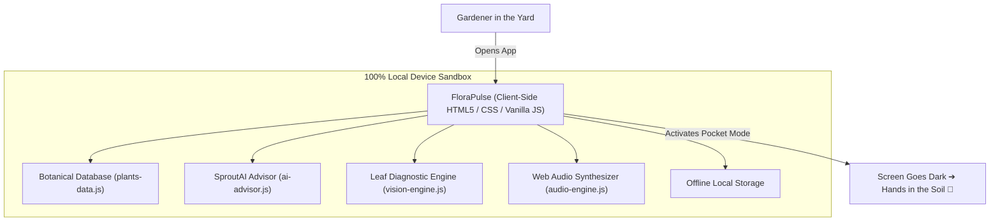

# FloraPulse: Why Open-Source AI is Built to Touch Grass 🌿

> *Submitted to the Hacktoberfest 2026 Open-Source AI Challenge — Week 1 Theme: Touch Grass*

---

## 1. The Paradox: Can AI Actually Help You Touch Grass?

Most software applications today are built around attention extraction. They measure success by "Daily Active Minutes," pinging your pocket with notifications to keep your eyeballs glued to glass.

When you step into a garden bed, greenhouse, allotment plot, or forest trail, that paradigm breaks down. Gardening is fundamentally tactile, olfactory, and sensory: feeling soil moisture with your index finger, smelling crushed tomato foliage terpenes, observing the angle of morning sunlight, and listening for pollinators.

So we asked a question: **Can we build an AI botanical application where the screen is intentionally the shortest part of the experience?**

Meet **FloraPulse**: an autonomous, client-side open-source AI garden intelligence and screen-minimizing outdoor companion.

---

## 2. Why Open Innovation Matters for Gardening

This challenge asked us to explain why an open-source approach worked better than a closed one. For gardeners and outdoor growers, the reasons are immediate and non-negotiable:

### 1. The Backcountry & Allotment Problem (Zero Internet)
Allotments, rural vegetable patches, community orchards, and nature trails frequently suffer from weak or nonexistent cellular reception. If your plant identification or disease diagnostic system depends on roundtrips to proprietary cloud endpoints (like OpenAI or Anthropic servers), it fails the moment you step into the dirt. **FloraPulse runs 100% locally in the browser.** All botanical knowledge graphs, heuristic reasoning engines, and leaf colorimetric algorithms execute on your device’s silicon.

### 2. Location & Backyard Privacy
Outdoor gardening involves sensitive private data: precise geolocation microclimates, backyard layout photos, and personal routines. Sending continuous sensor streams and camera captures of your private home to centralized servers creates unnecessary tracking telemetry. With open weights and local code, **zero bytes ever leave your machine**.

### 3. Community Accessibility & Zero Cost
Community gardens and school gardening clubs operate on tight budgets. They cannot afford recurring API subscription tiers or pay-per-token pricing. FloraPulse is free forever, permissively licensed under MIT, and runs on any laptop or phone with a web browser.

---

## 3. What We Built

### 🌿 Deep Botanical Knowledge Base
For every plant in the collection (vegetables, herbs, tropical houseplants, pollinators, berries, and succulents), FloraPulse delivers an exhaustive four-part profile:
- **Botanical Features:** Scientific taxonomy, family, mature dimensions, growth rate, and pet toxicity (dog/cat safety).
- **Required Environment:** Sunlight hours, soil type, optimal soil pH range (e.g. 6.2–6.8), USDA Hardiness Zones, temperature bounds, and humidity.
- **Maintenance & Care:** Watering cadence with the "2-Inch Knuckle Test", seasonal fertilizer NPK ratios, organic calcium/bone meal tips, pruning rules, pest defense (hornworms, aphids, blight) with organic remedies, and companion planting guilds (good vs. bad neighbors).
- **Touch Grass Action:** A 60-second micro-task that can be read in 10 seconds, prompting you to put your phone down immediately and tend to your plants.

### 🤖 SproutAI Local Reasoning Engine
An offline AI advisor that answers gardening dilemmas in real time without calling any cloud servers:
- Formulates custom soil mixes (Chunky Aroid blend, Living Vegetable bed mix, Gritty Succulent substrate).
- Diagnoses nutritional deficiencies and disease patterns.
- Answers seasonal care queries (e.g., *When do I harvest and cure hardneck garlic?*, *How do I prune English lavender without killing the woody base?*).

### 🔍 AI Leaf Diagnostic Scanner
A client-side diagnostic system analyzing plant symptoms (interveinal chlorosis, crispy edges, powdery mildew, leggy seedlings) and outputting organic treatment protocols.

### 🍂 October 2026 Frost & Planting Calendar
Dynamic countdown to the first killing autumn frost based on your USDA Zone, paired with essential mid-October tasks: planting garlic cloves, broadcasting winter cover crops (winter rye/hairy vetch), sowing frost-sweetened spinach, and harvesting forest leaf mulch.

### 🌙 Stealth "Pocket Mode"
Tap one button and your screen dims into ultra-low-power OLED stealth black with a gentle pulsing radar ring. Gentle pentatonic chimes (synthesized via the Web Audio API) alert you to outdoor timers, keeping your phone safely in your pocket.

---

## 4. System Architecture

---

## 5. Community Wisdom & Real-World Validation

Our architecture was informed by real-world practitioner insights from the DEV Community:

### 🌐 Community Wisdom: [Unlocking Client-Side AI: Running LLMs in the Browser with WebGPU](https://dev.to/zeno/unlocking-client-side-ai-running-llms-in-the-browser-with-webgpu-47ck)
> **Source**: [Zeno Rocha](https://dev.to/zeno)  
> **Tags**: `webgpu`, `ai`, `javascript`, `performance`  
>  
> *"Running AI models directly on the client with WebGPU fundamentally flips the cost and privacy equation. Once weights are cached on the device, you eliminate ongoing API bills, protect user location and sensor data from cloud leakage, and ensure instant offline responsiveness even with zero internet signal."*  
>  
> 🔗 [Read Full Discussion](https://dev.to/zeno/unlocking-client-side-ai-running-llms-in-the-browser-with-webgpu-47ck)

---

## 6. Try It & Go Touch Grass

- **Source Code & Local Runner:** Available in the project repository under MIT license.
- Run locally with PowerShell: `powershell -ExecutionPolicy Bypass -File .\server.ps1`
- Open `http://localhost:8080/` in your browser.

Now close your laptop, pick up a trowel, and go touch soil!
